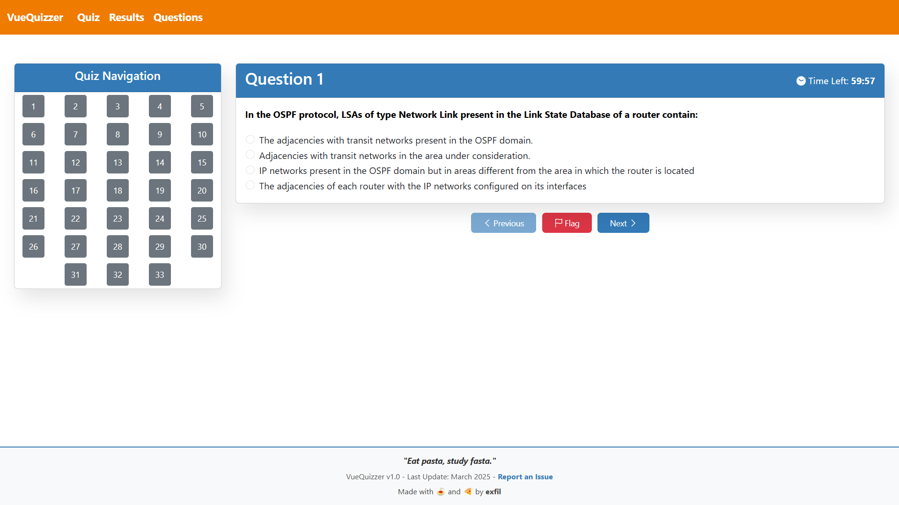
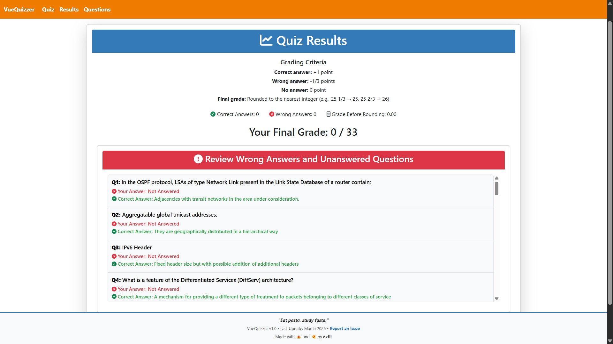

# VueQuizzer Feedback & Issues

This repository is dedicated to collecting **feedback, bug reports, and feature requests** for [VueQuizzer]  

## How to Report an Issue
1. Go to the **Issues** tab.  
2. Click **New Issue** and choose a template.  
3. Describe the bug, feedback, or suggestion clearly.  
4. Click **Submit** 

## Have an Idea?  
If you have a **feature request**, post it under the **Issues** tab and tag it as `enhancement`.  

## Screenshots

VueQuizzer: **[Try it out here](https://kurtoglusefa.github.io/vuequizzer/#/)**  
